# graft — Lifecycle, State & Failure Design

> Working design doc. Defines every component's lifecycle, **what happens on shutdown /
> restart** (what tears down, what persists, what happens when it comes back), every
> failure ordering, and how "stuck stuff" (deadwood, orphan / failed / pending leaves,
> ghost workers, zombie runners) is cleaned up **safely**. Marks **current** behavior vs.
> the **target** ("should"). Drives the backlog: GFT-17 (remediator), GFT-18 (elastic),
> GFT-20 (deadwood false-positive), GFT-21 (controller lock).

---

## 0. Design principles (the rules everything below obeys)

1. **Leaves are cattle, not pets.** A leaf runs exactly one job, then dies. On *any*
   disruption you **replace, never resume** — the JIT runner config is single-use anyway.
2. **The controller is the single source of truth — and a single point of failure.**
   Orchard has no HA (single instance, local BadgerDB). So: minimize its downtime
   (supervise + auto-restart), and make every other component **tolerate a blip** instead
   of cascade-failing.
3. **Cleanup must be safe.** Never destroy something that might be doing real work.
   `failed`/`disconnected` ≠ `idle`. The hard part of healing is the *restraint*.
4. **Each component cleans up after itself on graceful shutdown.** The monitor / remediator
   only handles leftovers from *un*graceful events (crashes, kills, partitions).
5. **Detect first, heal second, opt-in only.** Detection is always-on; remediation is
   deliberate, guarded, never default.
6. **A job's truth lives on GitHub, not in graft.** The runner talks to GitHub directly,
   so "graft lost the leaf" ≠ "the job failed."
7. **Recovery is per-component and deliberately blunt (settled decision, Aspen).**
   - **Controller** comes back and **resumes in place** — destroys nothing, resets nothing;
     workers reconnect and it picks up where it left off. The controller must **never** nuke.
   - **Worker** comes back by **nuking its leaves and starting clean** — this is Orchard's own
     restart behavior (it cannot re-adopt running VMs), so we embrace it rather than fight it.
     A worker bounce aborts the jobs running *on that worker only* — acceptable, because it's
     rare, severe, and structurally cannot cascade from a controller blip.
   - A **wedged or crashed worker** is simply **restarted by its `--tend` agent** — no
     busy-check, no zero-running guard, no graceful reconnect-resume. Detect wedged/crashed →
     restart → it comes up clean. This is also the fix for the scenario-5 reconnect anomaly.
   - We choose **simplicity over slot-reclamation speed**: the GitHub busy-check / safe-reaper
     (GFT-17) is **demoted to a later optimization**, built only if idle-running-orphan
     slot-clogging ever bites in practice.
8. **The supervisor never execs into a leaf at all.** It passes the JIT token + runner
   bootstrap as the leaf's **`StartupScript`** at `orchard create vm` time; the **worker** (local
   to the VM) delivers and launches it — not the supervisor. The supervisor then monitors purely
   by **polling GitHub** (runner online ⇒ keep, offline-after-online ⇒ replace, §3.2). No
   supervisor→guest connection exists at all, so controller blips and supervisor restarts are
   non-events — §3.1's reconcile is just the *normal* path. (Local-Tart, same-host, uses a local
   `tart exec` to launch; the GitHub-poll monitoring is identical. The token sits in the VM
   record briefly — single-use + short-lived, so the exposure window is tiny. Rich live job
   status returns later as a *voluntary* leaf→controller→supervisor push — never a pull.)

---

## 1. Components, ownership & secrets

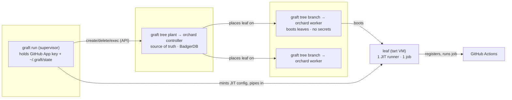

| Component | Command | Owns | Secrets | Persistent state | Source of truth for |
|---|---|---|---|---|---|
| **Supervisor** | `graft run` | desired runner count, JIT registration | **GitHub App PEM** | `~/.graft/state/pool.json` | what graft *wants* |
| **Controller** (trunk) | `graft tree plant` | scheduling, VM/worker registry | none | `~/.orchard/controller` (BadgerDB) | what *exists* cluster-wide |
| **Worker** (branch) | `graft tree branch` | the host's tart VMs, advertised capacity | **none** | tart VMs on local disk | what's *actually booted* on its host |
| **Leaf** (VM) | — | one ephemeral runner | the single-use JIT token | — | one job |
| **Monitor** | `--tend` | nothing — observes | none | `~/.graft/logs`, `state/health.json` | — |

**Cleanup ownership is the crux.** Normally the **supervisor** destroys a leaf (it created
the demand). When a failure severs that ownership, *nobody* owns the cleanup — that's where
deadwood comes from (§5).

---

## 1.5 Worker ↔ Controller protocol (verified against Orchard source)

Verified by reading the **Orchard** source (`cirruslabs/orchard`, `main`). The relationship
is **Kubernetes-style declarative reconciliation**: the controller holds *desired* state, the
worker drives *actual* toward it and reports status back. This section is ground truth — the
rest of the doc builds on it.

**Verified facts:**

- **Desired VM set** — the worker **short-polls `GET /v1/vms?worker=<name>` every 5s**, plus a
  websocket "nudge" for immediacy. It is *not* a spec stream; the watch channel only carries
  sync nudges + port-forward/resolve-IP.
- **Heartbeat** — `PUT /v1/workers/:name` **every 15s**; the controller marks a worker
  **offline at 180s** (`workerOfflineTimeout`).
- **Capacity** — the worker advertises resources at registration (`org.cirruslabs.tart-vms`,
  `memory-mib`, `logical-cores`); the controller computes *free = advertised − scheduled*.
- **Startup triage is BUILT-IN** (`syncOnDiskVMs`, once per session): ignores non-`orchard-`
  VMs; managed + unknown-to-controller → **stop + delete**; managed + lost-track → **stop +
  report failed**.
- **A worker restart is NOT transparent.** A previously-running VM is **stopped and reported
  `failed`** ("Worker lost track of VM"), never resumed. → *an in-flight job never survives a
  worker bounce.*
- **A controller restart destroys nothing and resets no state.** VMs keep running; only if the
  controller is down **past 180s** do workers cross offline and the scheduler marks their VMs
  `failed` on recovery (the tart VMs aren't killed by the controller). → *a controller blip
  under ~3 min is harmless to in-flight work.*
- **Identity / re-adoption** — the worker record is **upserted by name + machineID** (preserves
  `SchedulingPaused`); VM identity = `orchard-<name>-<uid>-<restartCount>`, fully derivable from
  controller state (no local bookkeeping file).
- **VM statuses are only `pending` / `running` / `failed`** (`failed` = sole terminal). Only the
  **worker** can set `running`. Stop/suspend live in `PowerState` + Conditions, not `VMStatus`.

### 1.5.1 Sequence — worker startup → steady-state

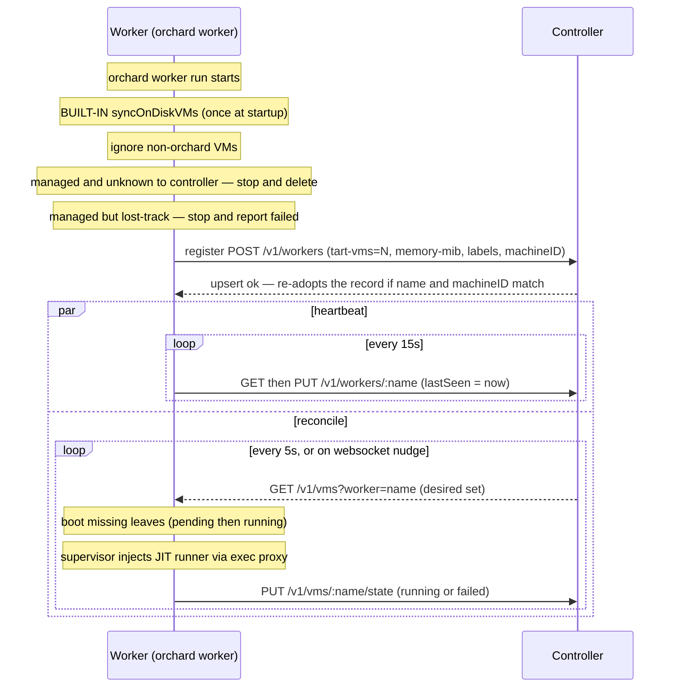

### 1.5.2 Worker state — the worker's own POV

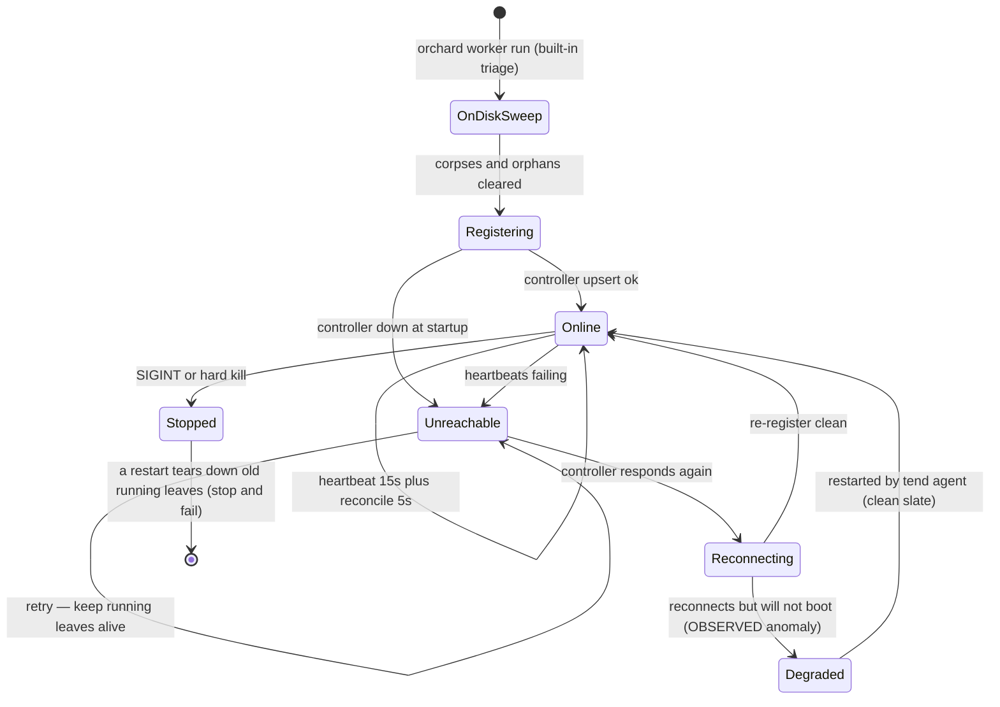

A worker restart is **destructive** — `Stopped → restart` stops and fails whatever was running.
We accept that (§0.7): a wedged or crashed worker is *just restarted* — jobs on that host are
aborted, by design (simplicity for now).

### 1.5.3 Controller's view — the worker's registry entry

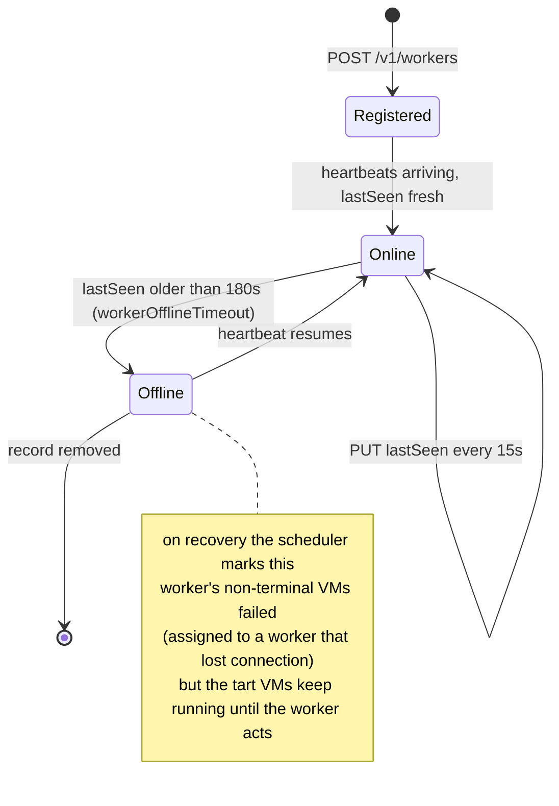

### 1.5.4 VM status — the 3-state model both sides share

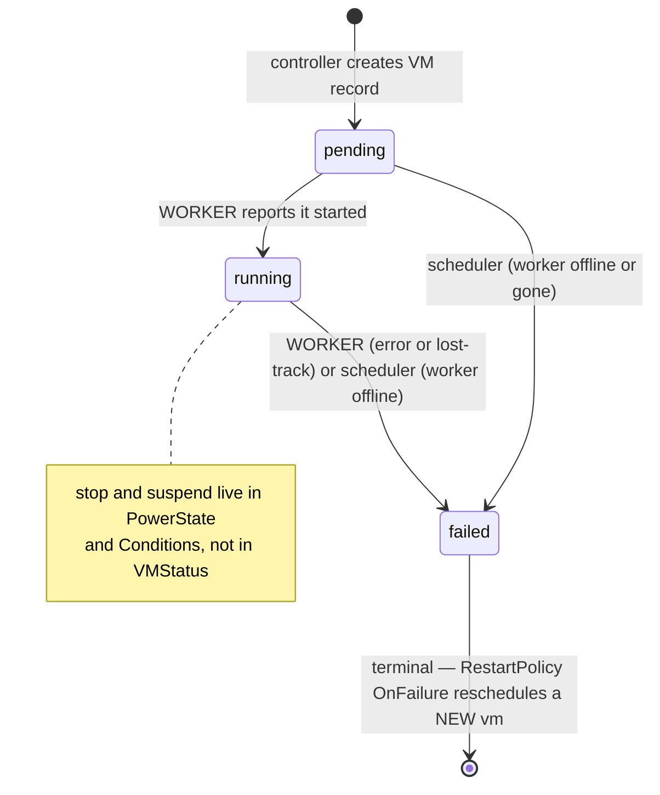

### 1.5.5 Design implications

- **`staleThreshold` 120s → 180s.** Today we flag a worker stale 60s *before* the controller
  does — align to `workerOfflineTimeout`.
- **Don't duplicate Orchard.** `syncOnDiskVMs` already does the startup orphan-sweep. The
  `tree branch --tend` agent's real scope is what Orchard *doesn't* do: host vitals, alerting,
  **process-level worker restart** (the one thing Orchard can't do to itself), and feeding the
  supervisor's GitHub busy-check.
- **A wedged or crashed worker is just restarted** by the `--tend` agent — no guard (see §0.7).
  Orchard nukes its old leaves on the way back up and the supervisor re-acquires the freed slots.
  A worker bounce aborts that host's running jobs by design (simplicity for now).
- **Prefer controller restarts (safe) over worker restarts (destructive); keep controller
  downtime under 180s.**

---

## 2. State machines

### 2.1 Leaf (VM)

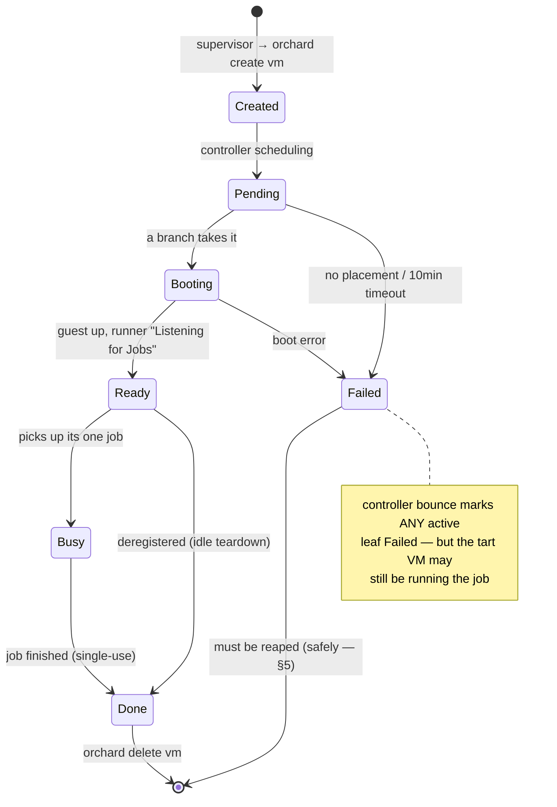

> Orchard's underlying status is only `pending` / `running` / `failed` (§1.5.4) — the states
> above are graft's overlay on top of those three.

### 2.2 Slot (the supervisor's unit of demand — one per desired runner)

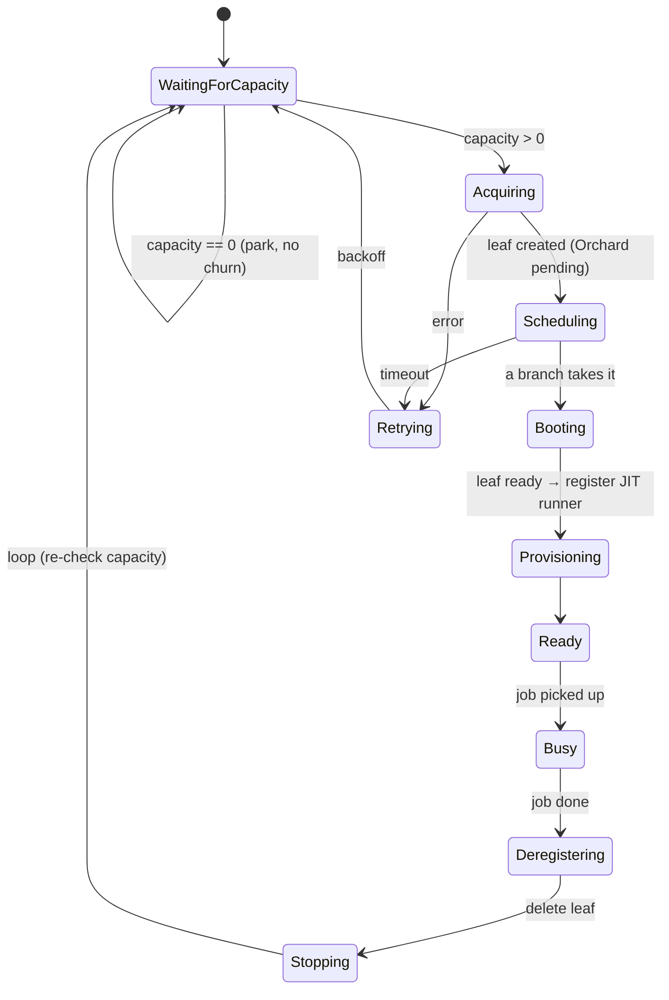

### 2.3 Worker (branch)

See **§1.5** — the worker's state machine (§1.5.2) and the controller's view of it (§1.5.3)
are drawn there, verified against Orchard source. The stale threshold is **180s**
(`workerOfflineTimeout`), not 120s.

### 2.4 Controller (trunk)

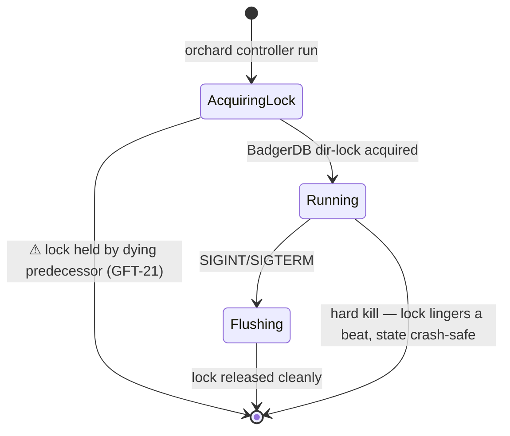

---

## 3. Shutdown & restart semantics — what tears down, what stays

The part that matters most. For each component: **graceful** (SIGINT), **hard kill**, and
**restart**.

### Controller (trunk)
| | Behavior |
|---|---|
| **Graceful** | Flush BadgerDB, release the dir lock. **Persists:** entire registry (workers, VMs, accounts). **Tears down:** nothing — it owns no VMs. Leaves keep running on workers. |
| **Hard kill** | BadgerDB is crash-safe; lock lingers briefly (**GFT-21** → next plant fails first try). |
| **Restart** | Reloads registry → workers reconnect. Marks VMs `Failed` only if a worker stayed offline past 180s (a **false positive** — the VM may still be running; see §3.1). Owns no leaf recovery — the **supervisor** reconciles those (§3.1). |

### Worker (branch)
| | Behavior — **current** | **Should** |
|---|---|---|
| **Graceful** | Exits; **leaves its tart VMs running** (stranded) | **Drain**: stop taking new leaves, let in-flight jobs finish, then destroy its leaves and exit |
| **Hard kill** | tart VMs persist on disk (stranded); controller shows worker as ghost until stale | branch agent (`tree branch --tend`) flags stranded `orchard-graft-*` VMs (built); remediator reaps them |
| **Restart** | Re-registers; does **not** reclaim its old stranded VMs | Re-register **and** reconcile local tart VMs against the controller — destroy any the controller doesn't know about |

### Supervisor (`graft run`)
| | Behavior |
|---|---|
| **Graceful** | `cleanup()`: deregister runners from GitHub, delete all its leaves, clear state. **Tears down:** every leaf + registration it owns. |
| **Hard kill** | Leaves + runner registrations **leak**. `~/.graft/state` holds the last snapshot. |
| **Restart** | `reconcile()` from `~/.graft/state` → **re-adopt leaves whose GitHub runner is online, delete the rest** (§3.1). *Today it blanket-deletes leftovers — the change this work makes.* |

### Leaf (VM)
Ephemeral by definition. Graceful: destroyed after its one job. On disruption we **replace,
don't resume** *a dead or interrupted job* — but a leaf whose **runner is still online** is kept
and waited out, not replaced (§3.1). Never delete a leaf whose job is still running (§5).

### 3.1 Recovery model — the reconcile (settled, Aspen)

The supervisor recovers from **both** a controller blip (it stayed alive) and its **own restart**
with **one decision** — differing only in where it learns which leaves are its own.

**Where "my leaves" come from:**
- **Controller blip** (supervisor alive) → its in-memory slot→leaf bindings. It must **hold**
  them through the outage — *never* abandon-and-reacquire. Abandoning leaks the still-running leaf
  as false `deadwood` (untrack succeeds, the delete fails on the dead controller) and starves the
  fleet at 0 capacity. **This is the bug we hit live.**
- **Supervisor restart** (process died) → `~/.graft/state`. In-memory bindings and the live exec
  watch are gone; it rebuilds the list from disk and matches each leaf's runner on GitHub by name.

**The decision (identical either way), per leaf, once the controller is reachable — keyed on the
GitHub runner, the source of truth:**

| GitHub runner | Meaning | Action |
|---|---|---|
| online, busy | running its job | **keep** + resume (poll) |
| online, idle | booted, no job yet | **keep** + resume (poll) |
| offline / gone | finished (ephemeral) or died | **delete + re-acquire** |
| unknown / GitHub unreachable | can't tell | **keep** — never murder a possible job |

So: **runner online ⇒ keep, runner offline ⇒ replace.** `want` is satisfied by the kept leaves,
so no needless acquire fires. Worst case is bounded by GitHub's own **job timeout** (a hung job
eventually goes offline → replaced).

**Monitoring after re-adoption = GitHub polling, not the exec stream.** A new `tart exec` can't
reattach to the already-running `run.sh` (it spawns a fresh guest process; you can't adopt a pipe
to a process you didn't fork) — and we were only ever *observing* the autonomous runner, not
driving it. GitHub already knows when the job is done, so we **poll runner status** instead. This
dissolves the old "no reattach" limitation. Cost: re-adopted leaves lose the live job-output
dashboard line (cosmetic).

**Never trust the controller's `failed` over GitHub.** After a >180s outage the scheduler marks a
worker's still-running VMs `failed` on recovery — a false positive. Controller says `failed` but
GitHub says online ⇒ the job is alive ⇒ keep it.

> One model, one truth (GitHub), two entry points (restart, reconnect).

### 3.2 Runner startup grace — "offline" means two things

GitHub shows nothing for a runner until `run.sh` registers it — *after* the VM boots, the worker
runs the `StartupScript`, and the runner downloads/registers. So a naive "offline ⇒ replace"
would nuke every leaf mid-boot and churn forever. The rule is **"was-online-then-gone ⇒
replace"**, never "offline ⇒ replace." Per-leaf, from the supervisor's view:

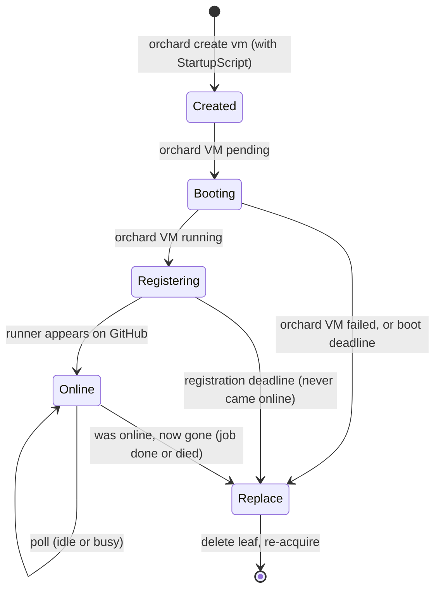

The supervisor watches **two layers**: the **orchard VM status** (pending → running → failed —
fast-fail on `failed`) and the **GitHub runner** (absent → online → gone, bounded by a
**registration deadline** ~3–5 min, configurable in the `monitor` block). Per leaf it tracks
`{ createdAt, sawOnline }`; `sawOnline` is what flips "not on GitHub" from *wait* to *replace*.
**Reconcile reuses this exactly**: on restart, a leaf whose runner isn't online but is younger
than the registration deadline (by its persisted `createdAt`) is still booting → wait; older →
replace. One grace rule for steady-state, startup, *and* recovery.

---

## 4. Failure-mode matrix

Every ordering, **now** vs **should**, who **detects**, who **recovers**.

| # | Scenario | What happens **now** | What **should** happen | Detected by | Recovered by |
|---|---|---|---|---|---|
| 1 | `graft run` starts, **can't reach controller** | `capacity()` falls back to `maxVMs` (>0) → tries to acquire → fails → retry churn | Park in `WaitingForCapacity`; **don't churn**; reconcile on reach (§3.1) | `controller-unreachable` (critical) | self — park then reconcile (§3.1) |
| 2 | **Controller dies** while leaves idle/busy | abandons leaves → `delete` fails → **leaked false deadwood** + parked at 0 capacity | **Hold** leaves; on reconnect reconcile online⇒keep / offline⇒replace (§3.1) | `controller-unreachable` | supervisor hold + reconcile (§3.1) |
| 3 | **Controller bounce** (down→up) | ghost workers excluded (fixed); abandoned leaves clog slots → park forever | hold leaves; reconcile (§3.1) — kept leaves satisfy `want`, no re-acquire | `capacity-shortfall` (critical) | supervisor reconcile (§3.1) |
| 4 | **Worker dies** | its leaves orphaned; worker is a ghost in the registry until stale | stale-exclude the worker (✅ done); reap its orphaned leaves | stale worker in `tree branches`; `capacity-shortfall` | stale exclusion (done) + remediator |
| 5 | **Worker degraded** (reconnects but won't boot, `pending` forever) | ⚠ stuck — leaves never boot | **`--tend` agent restarts the worker** → clean slate (§0.7); no graceful-resume attempt | `wedged-slot`, `capacity-shortfall` | `--tend` worker-restart |
| 6 | **Branch starts on a host with pre-existing deadwood** | stranded `orchard-graft-*` tart VMs sit unused, eating disk/slots | branch agent flags them (✅ built); reap on startup | `host/orphan-leaf` (branch agent) | remediator / `graft leaf rm` |
| 7 | **Supervisor (`graft run`) dies** | on restart `reconcile()` blanket-**deletes** leftover leaves (aborts running jobs) | reconcile from state (§3.1): re-adopt online leaves, replace dead | `deadwood`, `offline-runner` | `reconcile()` (§3.1) |
| 8 | **Failed leaf clogs a slot** | capacity stuck at 0; manual `orchard delete vm` needed | reap `Failed` leaves on the park-gate — **but never if the runner is still busy** | (gap — `failed`+owned trips nothing) | remediator (safe reaper) |
| 9 | **Leaf stuck `pending`** (never boots) | flagged `wedged-slot` ✅ **and** falsely `orphan-vm` ❌ (GFT-20) | flag `wedged-slot` only; after a timeout, delete & re-acquire | `wedged-slot` (correct) | supervisor retry / remediator |
| 10 | **Zombie runner** on GitHub (registered, offline) | flagged (excludes owned, ✅) | deregister it | `offline-runner` | `graft runners prune` / remediator |

---

## 5. The "stuck stuff" taxonomy & safe cleanup

Each kind of leftover, the vantage that can see it, and **the rule for when it's safe to
reap** — the most important column, because reaping the wrong thing kills live work.

| Kind | What it is | Seen from | Detector | **Safe to reap when…** | Owner |
|---|---|---|---|---|---|
| **Stranded tart VM** | tart VM the controller forgot | the **worker** | `host/orphan-leaf` (branch agent) ✅ | stopped, `orchard-graft-*`, not in controller's list | branch remediator |
| **Orphan leaf** | controller VM no slot owns | the **supervisor** | `supervisor/orphan-vm` | not in any slot's tracked/in-flight set | supervisor / remediator |
| **Failed leaf** | leaf in `Failed`, clogging a slot | controller | (gap) | `Failed` **and** its runner is **not busy** on GitHub | remediator |
| **Pending-stuck leaf** | created, never booted | supervisor | `wedged-slot` ✅ | past acquire timeout (the slot deletes + retries) | supervisor |
| **Ghost worker** | listed, not heartbeating | controller | stale in `tree branches` ✅ | last-seen > threshold → excluded from capacity (✅), prune optional | stale exclusion |
| **Zombie runner** | GitHub runner registered+offline | GitHub | `offline-runner` ✅ | offline **and** not owned by a live slot (✅) | `runners prune` |
| **In-flight leaf** | a leaf a slot is acquiring | supervisor | — | **NEVER reap** (GFT-20: track it the moment it's created) | — |

**The reap decision (this is the whole safety model):**

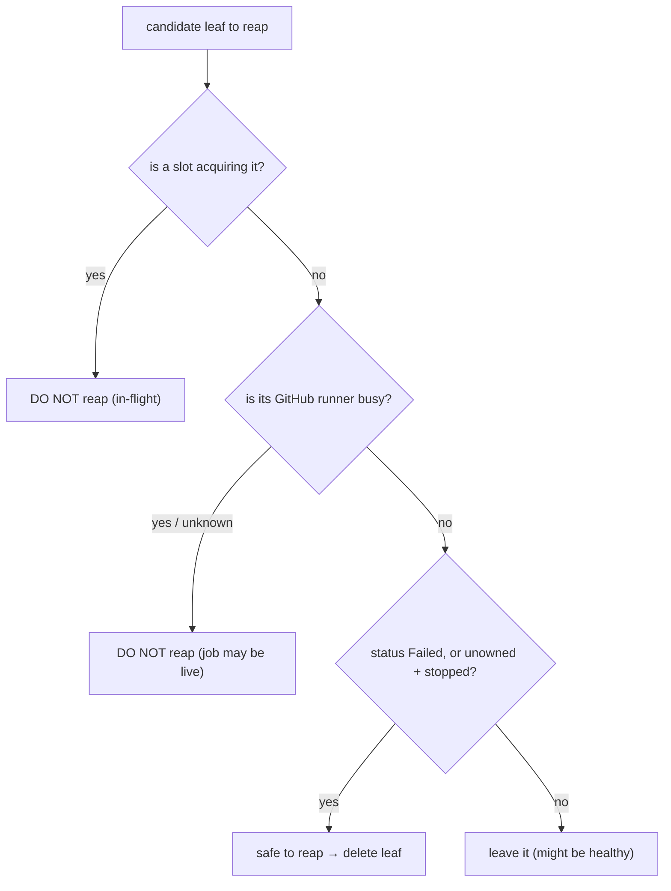

---

## 6. Sequence diagrams — the cascades

### 6.1 Controller bounce (the one we hit)

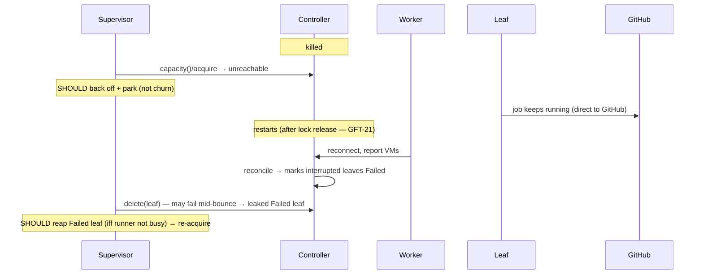

### 6.2 Worker death

```mermaid
sequenceDiagram
    participant C as Controller
    participant W as Worker
    participant S as Supervisor
    Note over W: killed
    C-->>C: still lists W (heartbeat not yet timed out)
    S->>C: capacity() — counts W's ghost slots (STALE FIX: excluded after 180s — workerOfflineTimeout)
    Note over C: W's leaves now orphaned on the (dead) host
    Note over S: capacity drops → park; orphan leaves reaped by remediator
```

### 6.3 Supervisor restart

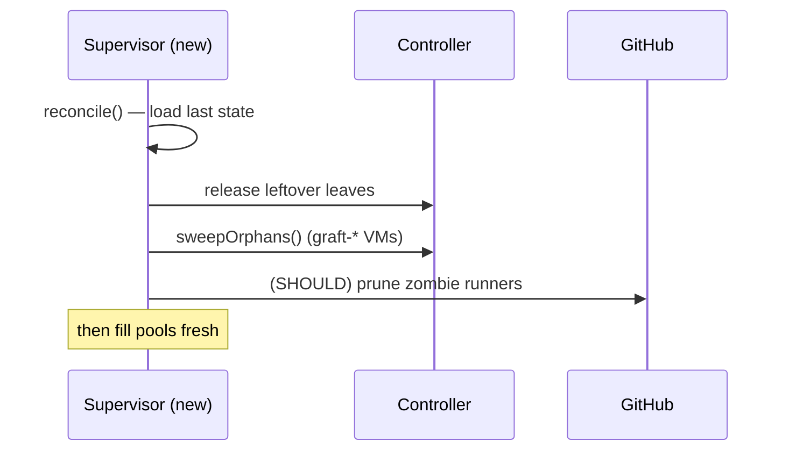

---

## 7. Open questions — mostly answered now (verified against Orchard source)

- **Does an in-flight job survive a controller blip?** → **Yes, if the controller returns
  before the 180s worker-offline timeout.** A controller restart kills nothing and resets no
  state; only a longer outage makes the scheduler mark VMs `failed` on recovery (the tart VMs
  aren't killed by the controller). See §1.5.
- **Does a worker restart resume its running VMs?** → **No.** It stops them and reports
  `failed` ("Worker lost track of VM"). An in-flight job never survives a *worker* bounce. §1.5.
- **Worker heartbeat interval?** → **15s heartbeat, 180s offline.** Set `staleThreshold` ~180s.
- **STILL OPEN — Scenario 5 (reconnect-degraded):** the source's happy path says a reconnected
  worker resumes booting, but we *observed* it not booting. This contradicts the model and is
  the one thing worth reproducing. Likely suspects: the websocket watch didn't re-establish (so
  no sync nudges, only the 5s poll), or the controller was down past 180s and the worker is
  stuck on stale/failed assignments.

---

## 8. Maps to the backlog

| Item | This doc's section |
|---|---|
| **GFT-17** busy-check safe-reaper | **DEMOTED** → later optimization (§0.7); §5 flow, matrix #8 |
| **GFT-18** elastic supervision | §2.2 slot machine, matrix #1/#4 |
| **GFT-20** deadwood false-positive | §5 in-flight leaf, matrix #9 |
| **GFT-21** controller lock on Ctrl-C | §2.4, §3 controller |
| **NEW**: worker graceful drain | §3 worker "should" |
| **NEW**: worker reconnect-degraded | matrix #5 |
| **NEW**: failed-leaf detector | matrix #8, §5 gap |
| **NEW**: staleThreshold 120s → 180s | §1.5.5 (match `workerOfflineTimeout`) |
